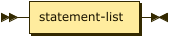

**program:**



```
program  ::= statement-list
```

**statement-list:**


```
statement-list
         ::= statement+
```

referenced by:

* compound-statement
* program

**statement:**


```
statement
         ::= expression-statement
           | compound-statement
           | selection-statement
           | iteration-statement
           | print-statement
           | declaration
```

referenced by:

* statement-list

**declaration:**


```
declaration
         ::= type-specifier identifier '=' constant-expression ';'
```

referenced by:

* statement

**type-specifier:**


```
type-specifier
         ::= 'CHAR'
           | 'INT'
```

referenced by:

* declaration

**expression-statement:**


```
expression-statement
         ::= constant-expression ';'
```

referenced by:

* statement

**constant-expression:**


```
constant-expression
         ::= logical-or-expression ( '=' logical-or-expression )*
```

referenced by:

* declaration
* expression-statement
* iteration-statement
* primary-expression
* selection-statement

**logical-or-expression:**


```
logical-or-expression
         ::= logical-and-expression ( '||' logical-and-expression )*
```

referenced by:

* constant-expression

**logical-and-expression:**


```
logical-and-expression
         ::= inclusive-or-expression ( '&&' inclusive-or-expression )*
```

referenced by:

* logical-or-expression

**inclusive-or-expression:**


```
inclusive-or-expression
         ::= exclusive-or-expression ( '|' exclusive-or-expression )*
```

referenced by:

* logical-and-expression

**exclusive-or-expression:**


```
exclusive-or-expression
         ::= and-expression ( '^' and-expression )*
```

referenced by:

* inclusive-or-expression

**and-expression:**


```
and-expression
         ::= equality-expression ( '&' equality-expression )*
```

referenced by:

* exclusive-or-expression

**equality-expression:**


```
equality-expression
         ::= relational-expression ( ( '==' | '!=' ) relational-expression )*
```

referenced by:

* and-expression

**relational-expression:**


```
relational-expression
         ::= shift-expression ( ( '<' | '>' | '<=' | '>=' ) shift-expression )*
```

referenced by:

* equality-expression

**shift-expression:**


```
shift-expression
         ::= additive-expression ( ( '<<' | '>>' ) additive-expression )*
```

referenced by:

* relational-expression

**additive-expression:**


```
additive-expression
         ::= multiplicative-expression ( ( '+' | '-' ) multiplicative-expression )*
```

referenced by:

* shift-expression

**multiplicative-expression:**


```
multiplicative-expression
         ::= primary-expression ( ( '*' | '/' | '%' ) primary-expression )*
```

referenced by:

* additive-expression

**primary-expression:**


```
primary-expression
         ::= identifier
           | constant
           | string
           | '(' constant-expression ( ',' constant-expression )* ')'
```

referenced by:

* multiplicative-expression

**unary-operator:**


```
unary-operator
         ::= '+'
           | '-'
           | '~'
           | '!'
```

**compound-statement:**


```
compound-statement
         ::= '{' statement-list '}'
```

referenced by:

* statement

**selection-statement:**


```
selection-statement
         ::= 'IF' '(' constant-expression ')' compound_statement ( 'ELSE' compound_statement )?
```

referenced by:

* statement

**iteration-statement:**


```
iteration-statement
         ::= 'WHILE' '(' constant-expression ')' compound_statement
```

referenced by:

* statement

**print-statement:**


```
print-statement
         ::= 'PRINT' '(' ( identifier | constant ) ')' ';'
```

referenced by:

* statement

## 
 <sup>generated by [RR - Railroad Diagram Generator][RR]</sup>

[RR]: https://www.bottlecaps.de/rr/ui